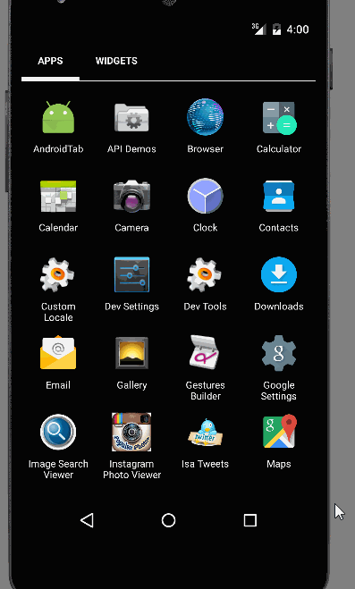

Android Bootcamp Week 4 Project 4 - Twitter With Fragments

Simple Twitter client that supports viewing a Twitter timeline

User Stories:

The following user stories must be completed:

* [x] User can sign in to Twitter using OAuth login
* [x] User can view the tweets from their home timeline
* [x] User should be displayed the username, name, and body for each tweet
* [x] User can switch between Timeline and Mention views using tabs.
* [x] User can view their home timeline tweets.
* [x] User can view the recent mentions of their username.
* [x] User can navigate to view their own profile
* [ ] User should be displayed the relative timestamp for each tweet "8m", "7h"
* [ ] User can compose a new tweet
* [ ] User can click a “Compose” icon in the Action Bar on the top right
* [ ] User can then enter a new tweet and post this to twitter
* [ ] User is taken back to home timeline with new tweet visible in timeline
* [ ] User can see picture, tagline, # of followers, # of following, and tweets on their profile.
* [ ] User can click on the profile image in any tweet to see another user's profile.
* [ ] User can see picture, tagline, # of followers, # of following, and tweets of clicked user.
* [ ] Profile view should include that user's timeline
* [ ] Optional: User can view following / followers list through the profile
* [ ] User can infinitely paginate any of these timelines (home, mentions, user) by scrolling to the bottom

Still work in progress, more will be added as soon!

GIF created with [LiceCap](http://www.cockos.com/licecap/).

Total Time spent: 7 hours

